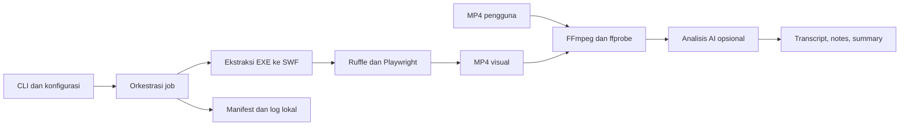

# Captivate Toolkit — Production Implementation Plan

> **For agentic workers:** Gunakan skill `executing-plans` untuk menjalankan rencana ini per tugas. Semua checkbox adalah pekerjaan mendatang, bukan klaim sudah selesai.

**Goal:** Mengubah inti `captivate_pipeline_v2.py` menjadi tool CLI Python publik di GitHub yang aman dibagikan, mudah dipasang, dapat diuji, dan memiliki batas kemampuan yang jelas.

**Architecture:** Package Python lokal dengan CLI tipis dan modul ekstraksi, render, media, analisis, konfigurasi, serta pengelolaan job. Pertahankan fungsi yang sudah berguna; pisahkan ketergantungan browser dan AI agar ekstraksi dasar tetap ringan. Gunakan fungsi dan dataclass sederhana; tidak perlu mengubah semuanya menjadi class.

**Tech Stack:** Python, argparse, pathlib, dataclasses, python-dotenv; extras Playwright dan OpenAI SDK; FFmpeg/ffprobe dan Ruffle sebagai runtime eksternal; pytest, Ruff, build, pip-audit, GitHub Actions.

**Spec:** Bagian 2–5 dalam dokumen ini adalah rancangan produk dan kontrak implementasinya. Ini proposal berdasarkan inspeksi lokal, belum merupakan keputusan produk yang disetujui atau implementasi.

## 1. Hasil pemeriksaan aktual

Inspeksi dilakukan 20 September 2026. Fokus hanya pipeline v2, nama/presensi konfigurasi `.env`, struktur folder, dan metadata media. Nilai rahasia tidak dicetak atau disalin. Tidak ada API AI yang dipanggil dan tidak ada EXE yang dijalankan.

| Bukti | Temuan | Dampak pada rencana |
|---|---|---|
| `captivate_pipeline_v2.py`, 535 baris; AST dapat diparse | Satu script menggabungkan konfigurasi, ekstraksi, HTTP server, browser, FFmpeg, AI, dan CLI | Ekstraksi modular bertahap dengan regression test |
| Baris 18–24 | `.env` dimuat dan konfigurasi dibaca saat import | Pindahkan ke konfigurasi runtime; import library tidak membaca rahasia |
| `.env` | Lima key terisi: `OPENAI_API_KEY`, `OPENAI_BASE_URL`, `TRANSCRIPTION_MODEL`, `VISION_MODEL`, `TEXT_MODEL` | Pertahankan nama key untuk migrasi; publik hanya menerima template kosong |
| Folder proyek | Belum ada `.git`, `.gitignore`, `README.md`, `pyproject.toml`, `tests`, `.github`, atau `LICENSE` | Siapkan distribusi dan repository dari awal |
| Baris 52–89 | FWS/CWS didukung; ZWS dilewati | Dukungan format harus eksplisit, bukan klaim semua EXE dapat dikonversi |
| Baris 76–85 | Header memiliki batas ukuran, tetapi hasil decompression tidak dibatasi sebelum dialokasikan | Batasi decompression aktual, jumlah kandidat, input, dan total output |
| Baris 107–115 | Dedup menggunakan panjang dan 64 byte awal/akhir; pemilihan utama memakai skor heuristik | Gunakan hash seluruh isi; tampilkan kandidat dan pilihan manual |
| Baris 220–235 | Browser headed; recording berdasarkan waktu tunggu setelah page load | Tambahkan readiness, timeout, mode headless, dan smoke test render |
| Baris 512–514 | Ruffle berasal dari URL unversioned | Gunakan aset Ruffle lokal dari versi yang diuji dan dicatat checksum-nya |
| Baris 258–272 | Semua kegagalan ekstraksi audio berubah menjadi `None` | Bedakan tidak ada audio dengan error FFmpeg |
| Baris 329–331 | Sampling frame menggunakan pembagian bulat | Sebaran dapat mengabaikan bagian akhir; gunakan sampling merata dengan timestamp |
| Baris 335–378 | Prompt khusus SAP dan Bahasa Indonesia | Jadikan `sap` preset; sediakan preset tutorial umum |
| Baris 396–405 | Hasil AI baru ditulis setelah semua panggilan selesai | Simpan setiap tahap segera untuk mengurangi pengulangan request berbayar |
| Baris 410–431 | Nama output unik, tetapi check-then-mkdir tidak atomik | Pertahankan non-overwrite; gunakan mkdir eksklusif dengan penanganan collision |
| Baris 475–478 | Analisis terikat pada render EXE dalam eksekusi yang sama | Sediakan analisis MP4 mandiri |
| Baris 530–531 | Exit gagal hanya bila tidak ada file yang sukses | Batch dengan sebagian gagal harus menghasilkan exit nonzero |

`ffprobe` tersedia. Dua sample hasil render (`BC400_OBJECT_NAVIGATOR_03` dan `BC400_REPOSITORY_INFORMATION_SYSTEMS_02`) berisi H.264 1024×776, durasi 101 detik, tanpa stream audio. `1.mp4` berisi H.264 dan audio AAC, durasi sekitar 79,55 detik. Ini bukti metadata sample lokal, bukan jaminan seluruh output atau kualitas visualnya.

Fondasi yang dipertahankan: EXE dibaca sebagai data, subprocess memakai daftar argumen, server terikat ke `127.0.0.1`, output dipisah per input, server ditutup dalam `finally`, dan analisis sudah opsional. Belum dilakukan pengujian end-to-end baru.

## 2. Arah produk yang direkomendasikan

**Posisi produk:** tool lokal untuk mengekstrak SWF dari projector EXE Adobe Captivate/Flash, merekam visual yang kompatibel dengan Ruffle, dan menghasilkan catatan tutorial dengan AI opsional.

| Bentuk distribusi | Kelebihan | Tambahan pekerjaan | Keputusan awal |
|---|---|---|---|
| CLI + package Python di GitHub | Paling dekat dengan MVP; mudah diotomasi dan diuji; file diproses lokal | Instalasi Python, browser, FFmpeg | Direkomendasikan untuk rilis pertama |
| Aplikasi desktop | Lebih mudah bagi pengguna nonteknis | Installer, bundling runtime, UI progress/cancel, update per OS | Sesudah inti stabil jika target pengguna membutuhkannya |
| Web app yang di-host | Akses melalui browser | Upload besar, isolasi job, penyimpanan, biaya, autentikasi, penghapusan data | Proyek terpisah setelah ada kebutuhan nyata |

GitHub adalah tempat distribusi kode dan rilis; publikasi repository sendiri tidak menjadikan pipeline sebuah layanan web. Tool Python murni dapat layak produksi tanpa framework besar atau class hierarchy.

Asumsi perencanaan: pengguna teknis menjalankan CLI lokal dan membawa API key sendiri. Nama kerja package `captivate-toolkit`, import `captivate_toolkit`, command `captivate`; ketersediaan nama publik belum diperiksa. Fokus validasi pertama Windows karena lingkungan MVP adalah Windows. Ekstraksi/core juga diuji di Linux; dukungan render per OS hanya diumumkan setelah diuji.

## 3. Batas rilis dan definisi selesai

### v0.1.0 — public beta yang dapat digunakan

- Ekstraksi FWS/CWS, daftar kandidat, pemilihan kandidat utama manual, batch serial.
- Render visual berdurasi eksplisit; readiness player, batas waktu, dan status kegagalan terlihat.
- Analisis MP4 mandiri; transcript bila audio tersedia, visual notes, dan summary Markdown.
- AI opsional; ekstraksi/render tidak memerlukan API key dan tidak memanggil layanan AI.
- Konfigurasi tervalidasi, package installable, dokumentasi instalasi, test, CI, serta manifest per job.
- Tidak menjanjikan seluruh versi Captivate, ZWS, audio capture dari browser, atau penyelesaian otomatis tutorial interaktif.

### v0.2.x — berdasarkan masalah pengguna beta

- Resume dari manifest yang memvalidasi hash input, konfigurasi, versi, dan artefak.
- Pemrosesan audio panjang/chunking bila kasus nyata membutuhkan.
- Optimasi scene/frame selection dan dukungan OS tambahan setelah benchmark.
- Evaluasi preservasi audio SWF atau metode capture audio terpisah; ukur sinkronisasi audio-video sebelum menjanjikannya.

### v1.0.0 — kontrak stabil

- Seluruh gate v0.1 lulus, smoke test pengguna baru berhasil dari instalasi bersih, dan compatibility matrix tersedia.
- CLI, environment keys, exit codes, serta manifest schema terdokumentasi; kebijakan perubahan kompatibilitas jelas.
- Tidak ada defect rilis yang menyebabkan kebocoran key, output tertimpa, atau status sukses palsu untuk kegagalan yang terdeteksi.
- Ada bukti end-to-end untuk set sample yang sah dan representatif; daftar konten yang tidak didukung dipublikasikan.

GUI, backend API, database, queue worker, multiuser, telemetry, plugin framework, dan parallel batch tidak diperlukan untuk gate v1.0 CLI ini.

## 4. Kontrak penggunaan dan konfigurasi

Contoh berikut adalah **CLI yang direncanakan**, belum tersedia sekarang:

```console
captivate --help
captivate doctor
captivate extract lesson.exe --out output
captivate render output/lesson/swf/main.swf --seconds 90 --ruffle-dir ./ruffle --out rendered
captivate analyze lesson.mp4 --env-file .env --preset sap --language id --out analysis
captivate run lesson-a.exe lesson-b.exe --seconds 90 --ruffle-dir ./ruffle --out output
captivate run lesson.exe --seconds 90 --ruffle-dir ./ruffle --analyze --env-file .env --out output
```

- `doctor`: cek dependensi lokal, versi, Chromium terpasang, encoder FFmpeg, dan path Ruffle. Tidak memanggil API berbayar; capability provider dicek hanya lewat opsi eksplisit `--check-api`.
- `extract`: menampilkan semua kandidat beserta indeks, offset, ukuran, hash, marker, dan alasan kandidat utama. `--swf-index N` mengatasi pilihan heuristik yang salah.
- `render`: default headless dengan `--headed` untuk diagnosis. Timeout startup berbeda dari durasi rekaman. `--seconds` wajib positif dan finite.
- `run`: default extract saja; `--seconds` mengaktifkan render; `--analyze` memerlukan render. Validasi kombinasi flag sebelum output atau request dibuat.
- `analyze`: `--preset general|sap` (default `general`), `--language id|en` (default `id`), `--frame-interval` positif (default 8), `--max-frames` positif (default 12). Audio tanpa dukungan provider dapat dinonaktifkan dengan `--skip-transcription` secara eksplisit.
- Exit codes: `0` seluruh pekerjaan yang diminta berhasil; `1` minimal satu job/tahap yang diminta gagal; `2` penggunaan/config salah; `130` dibatalkan pengguna. Batch melanjutkan file lain setelah kegagalan per file.
- Kegagalan AI tidak menghapus MP4/SWF yang sudah jadi. Output menunjukkan lokasi hasil parsial dan tahap yang gagal.

**Aturan konfigurasi:** flag nonrahasia > process environment > file yang dipilih melalui `--env-file` > default. Tidak menelusuri `.env` direktori induk secara otomatis. API key hanya lewat environment/file, tidak melalui flag agar tidak masuk shell history. `.env` lama tetap dapat dipakai dengan `--env-file .env`.

| Key lama | Aturan target |
|---|---|
| `OPENAI_API_KEY` | Wajib hanya saat melakukan analisis; tidak pernah dicetak atau ditulis ke manifest |
| `OPENAI_BASE_URL` | Default API OpenAI; custom endpoint didukung berdasarkan capability yang benar-benar diuji; URL berkredensial ditolak |
| `TRANSCRIPTION_MODEL` | Validasi saat transkripsi diperlukan; tidak wajib untuk video tanpa audio |
| `VISION_MODEL` | Validasi saat analisis visual diperlukan |
| `TEXT_MODEL` | Bila tidak diisi, fallback ke `VISION_MODEL` untuk kompatibilitas perilaku lama |

`.env.example` direncanakan berisi:

```dotenv
# Isi sendiri. File ini tidak berisi credential atau endpoint pribadi.
OPENAI_API_KEY=
OPENAI_BASE_URL=https://api.openai.com/v1
TRANSCRIPTION_MODEL=
VISION_MODEL=
TEXT_MODEL=
```

Nama model dipilih pengguna dari provider yang digunakan. Template kosong bukan konfigurasi siap menjalankan AI. Jangan menyalin model, endpoint privat, atau key dari `.env` lokal ke contoh publik. Jelaskan bahwa analisis mengirim frame/audio/teks ke endpoint yang dikonfigurasi dan dapat menimbulkan biaya; mode tanpa AI memproses data lokal.

## 5. Arsitektur dan struktur target



Disarankan repository baru yang hanya berisi sumber publik, misalnya folder saudara `C:/CODING/SAP/captivate-toolkit`. Jangan menjadikan seluruh folder eksperimen VIDEO sebagai isi awal commit. Path di bawah relatif terhadap root repository target; dokumen rencana ini saat ini tersimpan dalam proyek VIDEO.

```text
captivate-toolkit/
  pyproject.toml
  README.md
  LICENSE
  CHANGELOG.md
  CONTRIBUTING.md
  SECURITY.md
  .env.example
  .gitignore
  captivate_pipeline_v2.py         # wrapper kompatibilitas CLI lama
  src/captivate_toolkit/
    __init__.py
    __main__.py
    cli.py                       # parser, pesan pengguna, exit codes
    config.py                    # Settings, loader dan validasi
    extract.py                   # decode, carve, ranking kandidat
    render.py                    # server lokal, browser, readiness, cleanup
    media.py                     # subprocess, probe, frame/audio extraction
    analysis.py                  # SDK adapter, transcribe, vision, summary
    pipeline.py                  # job serial, manifest, status dan output
    errors.py                    # ConfigError, ExtractionError, RenderError, MediaError, AnalysisError
    templates/player.html
    prompts/general.txt
    prompts/sap.txt
  tests/
    test_config.py
    test_extract.py
    test_cli.py
    test_media.py
    test_analysis.py
    test_pipeline.py
    integration/test_render.py
    fixtures/README.md
  docs/
    installation.md
    configuration.md
    compatibility.md
    troubleshooting.md
    releasing.md
  .github/
    workflows/ci.yml
    workflows/release.yml
    dependabot.yml
    ISSUE_TEMPLATE/bug_report.yml
    pull_request_template.md
```

Interface publik awal adalah CLI. Fungsi internal bertipe untuk memudahkan pengujian, tetapi belum dijanjikan sebagai library API stabil. Hindari service container, repository pattern, atau abstract provider hierarchy; cukup adapter OpenAI-compatible yang menerima client sebagai argumen agar bisa di-fake dalam test.

Manifest `manifest.json` memakai `schema_version: 1`, ID job, nama dan SHA-256 input, versi tool/dependensi penting, opsi nonrahasia, timestamp UTC, daftar artefak relatif, warning, serta status setiap tahap (`pending`, `running`, `succeeded`, `failed`, `skipped`). Catat alasan `skipped`, misalnya `no_audio_stream`. Jangan simpan key, raw request, frame base64, atau URL dengan credential. Tulis ke file sementara lalu `replace` secara atomik.

## 6. Urutan pekerjaan

### Task 1 — Siapkan repository publik dan baseline yang terukur

**Files:** buat `README.md`, `.gitignore`, `.env.example`, `pyproject.toml`, `tests/test_extract.py`, `tests/fixtures/README.md`; salin hanya pipeline v2 sebagai baseline. Buat `LICENSE` setelah pemilik menentukan lisensi.

- [ ] Catat kontrak perilaku lama dan sample lokal yang boleh digunakan untuk uji privat. Gunakan binary sintetis untuk test publik, bukan materi SAP/EXE/output lokal.
- [ ] Buat `.gitignore` sebelum `git init`/staging: `.env`, `.env.*` dengan pengecualian `.env.example`, virtualenv, cache, `captivate_output/`, `output/`, `dist/`, `build/`, `*.egg-info/`, dan media lokal. Fixture publik masuk hanya lewat allowlist yang direview.
- [ ] Tambahkan tes karakterisasi decode FWS/CWS, input invalid, ZWS unsupported, ranking marker, dan folder unik. Test tidak mengimpor script yang otomatis membaca `.env`; ekstrak fungsi murni atau gunakan AST hanya untuk baseline sementara.
- [ ] Scan source dan staged diff untuk secret; verifikasi isi wheel/sdist nanti juga. Bila ditemukan credential pernah dibagikan, cabut/rotasi key terkait sebelum publikasi; inspeksi ini belum membuktikan kebocoran.
- [ ] Lisensi kode ditentukan pemilik; rekomendasi awal MIT bila sesuai tujuan distribusi. Inventaris lisensi dependency/aset terpisah. File SAP/Adobe milik pengguna tidak menjadi fixture publik hanya karena berada di folder kerja.

**Gate:** source publik bebas secret dan media privat; baseline decode dapat diuji tanpa browser, FFmpeg, atau API. `.env` lokal di VIDEO tidak dipindah, diedit, atau di-commit.

### Task 2 — Package installable, konfigurasi, dan kompatibilitas CLI

**Files:** buat `src/captivate_toolkit/{__init__,__main__,cli,config,errors}.py`, `tests/test_config.py`, `tests/test_cli.py`; ubah `pyproject.toml` dan wrapper `captivate_pipeline_v2.py`.

**Interfaces:** `load_settings(env_file: Path | None, environ: Mapping[str, str]) -> Settings`; `main(argv: Sequence[str] | None = None) -> int`. `Settings` dataclass menyimpan kelima key lama; representasi key dirahasiakan.

- [ ] Tulis test precedence config, key kosong saat extraction, kegagalan analisis tanpa key, fallback text model, dan import tanpa efek samping.
- [ ] Gunakan `pyproject.toml` untuk package `src` layout dan entry point `captivate = "captivate_toolkit.cli:main"`. Extras `render` untuk Playwright, `ai` untuk SDK, `dev` untuk pengujian/build. FFmpeg/Ruffle/Chromium tetap prerequisite yang didiagnosis terpisah.
- [ ] Tetapkan Python 3.11 sebagai minimum usulan; CI menguji 3.11 dan versi stabil terbaru yang didukung semua dependency. Baru cantumkan classifier versi yang benar-benar lulus.
- [ ] Pertahankan argumen v2 melalui wrapper migrasi; wrapper memakai konfigurasi eksplisit pada runtime dan menjelaskan pemetaan command baru. Dokumentasikan perubahan exit code sebagai perbaikan kontrak batch.
- [ ] Implementasikan `doctor` tanpa panggilan AI default. Bantuan CLI dan ekstraksi harus berjalan tanpa extras browser/AI terpasang.
- [ ] Build wheel/sdist, install wheel pada environment baru di luar source tree, uji `captivate --help` dan import.

Metadata entry point yang direncanakan:

```toml
[project.scripts]
captivate = "captivate_toolkit.cli:main"
```

**Gate:** instalasi dari clone dan wheel berhasil; ekstraksi tidak memerlukan key; konfigurasi tidak dibaca saat import. Packaging extras dan entry point mengikuti [PyPA](https://packaging.python.org/en/latest/guides/writing-pyproject-toml/).

### Task 3 — Ekstraksi terbatasi dan hasil batch yang dapat dipercaya

**Files:** `extract.py`, `pipeline.py`, `cli.py`, `tests/test_extract.py`, `tests/test_pipeline.py`, `tests/test_cli.py`.

**Interfaces:** `decode_embedded_swf(data: bytes, offset: int, *, max_swf_bytes: int) -> bytes | None`; `carve_swfs(exe_path: Path, out_dir: Path, *, limits: ExtractionLimits) -> ExtractionResult`. `ExtractionResult` berisi kandidat terurut dan path utama; setiap kandidat memiliki hash lengkap.

- [ ] Tulis tes input truncated, declared size palsu, stream CWS tidak selesai, decompression melebihi limit, offset invalid, ZWS, serta dua SWF berbeda dengan prefix/suffix sama.
- [ ] Terapkan batas awal yang dapat dikonfigurasi: input 512 MiB, satu SWF 128 MiB, total SWF 512 MiB, kandidat 256. Decompress secara bounded; batas header saja tidak cukup. Tolak stream yang tidak lengkap dan laporkan format unsupported secara berbeda dari tidak ada kandidat.
- [ ] Ganti fingerprint dengan SHA-256. Pertahankan ranking awal sebagai heuristik terdokumentasi; `--swf-index` memungkinkan override.
- [ ] Validasi input harus file reguler yang terbaca, flag numerik finite/positif, output dapat dibuat. Buat output secara eksklusif dan retry collision; jangan menimpa hasil lama.
- [ ] Pisahkan hasil job dari print. Mulai manifest sebelum tahap pertama, perbarui sesudah setiap tahap, lanjutkan batch ketika satu input gagal, kembalikan exit `1` jika ada kegagalan.

Contoh regression test perilaku decode yang ditargetkan:

```python
import struct
import zlib
from captivate_toolkit.extract import decode_embedded_swf

def test_cws_decodes_to_equivalent_fws():
    body = b"A" * 32
    header = bytes([9]) + struct.pack("<I", len(body) + 8)
    encoded = b"CWS" + header + zlib.compress(body)
    assert decode_embedded_swf(encoded, 0, max_swf_bytes=1024) == b"FWS" + header + body

def test_declared_swf_over_limit_is_rejected():
    encoded = b"FWS" + bytes([9]) + struct.pack("<I", 4096) + b"A" * 32
    assert decode_embedded_swf(encoded, 0, max_swf_bytes=1024) is None
```

Test ini menguji carver; payload sintetis di atas bukan fixture render SWF. Fixture render harus SWF valid dengan frame/timing yang diketahui.

**Gate:** file rusak/oversized gagal dengan pesan terarah; tidak ada output tertimpa; batch 1 sukses + 1 gagal menghasilkan exit `1` dan manifest yang sesuai.

### Task 4 — Render dapat direproduksi dan hasilnya tervalidasi

**Files:** `render.py`, `media.py`, `templates/player.html`, `tests/test_media.py`, `tests/integration/test_render.py`, `docs/compatibility.md`.

**Interfaces:** `render_swf(swf_path: Path, out_mp4: Path, *, options: RenderOptions) -> Path`; `probe_media(path: Path) -> MediaInfo`. `RenderOptions` memuat durasi, startup timeout, headed, ukuran viewport, dan direktori aset Ruffle. `MediaInfo` berisi durasi, dimensi, codec, serta ada/tidaknya audio/video.

- [ ] Bekukan satu build self-hosted Ruffle yang lulus sample test; catat versi, URL upstream, checksum, dan lisensi dalam release docs. Hindari CDN latest saat setiap job berjalan. Instalasi aset adalah langkah terpisah yang terdokumentasi.
- [ ] HTML mengirim status `loading/ready/error` ke Python. Tangkap kegagalan Ruffle, console error penting, HTTP asset gagal, dan timeout. Timer rekaman konten dihitung setelah player ready; trim startup recording bila perlu.
- [ ] Layani hanya direktori staging render di loopback, bukan root project atau `.env`. Izinkan request aset lokal yang diperlukan; blok koneksi keluar, popup, dan script access dari SWF secara default. Ruffle bukan jaminan keamanan penuh untuk upload publik.
- [ ] Tutup page/context/browser/server pada sukses, error, dan Ctrl+C. Tunggu video selesai ditulis sebelum FFmpeg; hapus hanya file temporary milik job tersebut.
- [ ] Beri subprocess timeout dan diagnostic stderr yang terbatas. Tulis MP4 ke temporary path, validasi `ffprobe`, lalu finalisasi. Default budget FFmpeg render `max(60, 2 × seconds)` detik dan startup 30 detik, dengan override terdokumentasi.
- [ ] Smoke test memakai animasi SWF sintetis yang punya perubahan frame: pastikan video stream ada, ukuran benar, durasi mendekati permintaan (toleransi 2 detik), dan bagian animasi fixture benar-benar berubah. Periksa manual sample Captivate lokal yang representatif.

**Gate:** aset gagal/player gagal tidak dilaporkan sukses; sample known-good menampilkan konten; proses browser/server tidak tertinggal. Keberadaan MP4 saja bukan bukti tutorial selesai. Tutorial interaktif tetap membutuhkan interaksi dan mungkin belum didukung.

Ruffle menyediakan bundle [self-hosted](https://ruffle.rs/js-docs/master/index.html) serta opsi [network/script access](https://ruffle.rs/js-docs/master/interfaces/Config.URLLoadOptions.html). Konfigurasi persis harus disesuaikan dengan build yang dibekukan. Playwright menjelaskan bahwa video difinalisasi saat [browser context ditutup](https://playwright.dev/python/docs/videos).

### Task 5 — Analisis mandiri dengan kegagalan parsial yang jelas

**Files:** `analysis.py`, `media.py`, `pipeline.py`, `config.py`, `prompts/general.txt`, `prompts/sap.txt`, `tests/test_analysis.py`, `tests/test_media.py`.

**Interfaces:** `select_frame_indices(total: int, limit: int) -> list[int]`; `analyze_video(video_path: Path, out_dir: Path, *, settings: Settings, options: AnalysisOptions, client) -> AnalysisResult`. `AnalysisOptions` berisi preset, bahasa, interval, max frames, dan skip transcription. `AnalysisResult` memuat path hasil, warning, serta status tiap tahap.

- [ ] Tulis fake-client tests untuk tanpa audio, invalid key, rate limit, timeout, provider tanpa vision/transcription, dan summary gagal sesudah transcript sukses. Semua berjalan tanpa key asli atau network.
- [ ] Probe media sebelum ekstraksi. Tidak ada audio = tahap transkripsi `skipped`; FFmpeg gagal pada media yang punya audio = `failed`, bukan transcript kosong diam-diam.
- [ ] Sampling frame merata mencakup awal/akhir bila limit > 1; limit 1 mengambil tengah. Sertakan timestamp dalam vision prompt dan notes. Batasi jumlah/dimensi frame yang dikirim; jangan decode seluruh durasi menjadi ribuan JPG jika hanya 12 akan dipakai.
- [ ] Gunakan preset umum/SAP dan bahasa eksplisit. Instruksi di transcript/layar diperlakukan sebagai data sumber; output menyebut informasi tidak terbaca atau tidak tersedia, tidak menebaknya.
- [ ] Atur timeout request 60 detik dan maksimal 2 retry dalam satu lapisan SDK, dengan backoff. Retry hanya error sementara; jangan retry auth/validation. Hindari lapisan retry tambahan yang menggandakan panggilan. Catat bahwa timeout/retry tetap dapat menimbulkan biaya ganda di provider.
- [ ] Validasi ukuran audio sebelum upload sesuai capability provider yang dikonfigurasi; file di luar batas gagal dengan petunjuk, chunking ditunda ke v0.2. Jangan mengasumsikan semua endpoint compatible mendukung semua model/modalitas.
- [ ] Simpan transcript segera, lalu notes, lalu summary; setiap penyimpanan atomik. API error tidak mencetak header/token/raw payload. Log request ID provider bila tersedia, model, durasi, dan usage yang dilaporkan; jangan mengarang harga/budget pasti.
- [ ] `analyze` bisa dijalankan pada MP4 lama tanpa carve/render ulang. Bila tahap wajib gagal, tampilkan hasil parsial, tulis manifest gagal, dan exit nonzero.

Contoh kontrak sampling:

```python
from captivate_toolkit.analysis import select_frame_indices

def test_sampling_covers_entire_video():
    indexes = select_frame_indices(total=23, limit=12)
    assert len(indexes) == 12
    assert indexes == sorted(set(indexes))
    assert indexes[0] == 0
    assert indexes[-1] == 22
```

**Gate:** MP4 tanpa audio tetap dapat dianalisis visual; MP4 ber-audio memiliki jalur transcript teruji; gagal di tengah tidak menghilangkan hasil tahap sebelumnya; tidak ada panggilan AI tanpa aksi analisis eksplisit.

### Task 6 — CI, dokumentasi, dan rilis GitHub

**Files:** `.github/workflows/{ci,release}.yml`, `.github/dependabot.yml`, template issue/PR, `README.md`, `CONTRIBUTING.md`, `SECURITY.md`, `CHANGELOG.md`, `docs/{installation,configuration,compatibility,troubleshooting,releasing}.md`.

- [ ] CI setiap PR: Ruff, unit tests offline, build wheel/sdist, install smoke test dari wheel di luar checkout, serta pemindaian secret/dependency. Instal dependency dari versi yang dikunci untuk environment pengujian; package metadata memakai rentang kompatibel yang telah diuji.
- [ ] Unit/core matrix Windows + Linux. Render smoke test minimal pada Windows dan runner headless yang akan diklaim didukung, memakai fixture sah dan Ruffle yang sudah dibekukan. Tes provider live hanya manual dan opt-in, tidak memakai secret pada PR dari fork.
- [ ] Set permission Actions minimum (`contents: read` untuk CI), pin actions pihak ketiga ke commit SHA terverifikasi, dan tetapkan timeout job. Ini mengikuti [panduan keamanan GitHub Actions](https://docs.github.com/en/actions/reference/security/secure-use).
- [ ] README mencakup satu kalimat manfaat, quickstart clone/install, extras, setup Chromium/FFmpeg/Ruffle, contoh tanpa AI, contoh dengan AI, bentuk output, privasi, biaya provider, keterbatasan audio/ZWS/interaksi, dan troubleshooting Windows.
- [ ] Isi compatibility matrix dengan versi toolchain yang benar-benar dipakai dan hasil sample: format, render, audio, interaksi, dan OS. Hindari klaim umum berdasarkan dua file lokal saja.
- [ ] Minta satu pengguna lain mengikuti README dari environment bersih. Catat waktu/setup error dan perbaiki langkah yang tidak jelas.
- [ ] Siapkan tag `v0.1.0`, changelog, wheel/sdist, checksum SHA-256, dan GitHub Release setelah gate lulus. Workflow release memerlukan tes sukses dan tag versi sesuai metadata. Jangan mengikutkan `.env`, EXE, MP4, transcript, atau folder output privat.
- [ ] PyPI adalah kanal berikutnya bila nama/distribusi sudah diputuskan; GitHub Release + instalasi dari clone cukup untuk beta pertama. Pembaruan dependency, triage bug, kebijakan versi, serta prosedur rollback terdokumentasi.

**Gate:** orang lain dapat memasang dari dokumentasi, menjalankan sample publik tanpa key, dan memahami cara mengaktifkan AI dengan key sendiri. Artefak rilis telah diperiksa, CI hijau, serta limitations tidak tersembunyi.

## 7. Cara validasi saat implementasi

Untuk setiap perubahan perilaku: buat regression test, jalankan dan lihat kegagalannya, lakukan perubahan minimum, jalankan kembali test relevan. Pisahkan commit per task setelah gate lulus. Nama test harus menjelaskan perilaku pengguna yang dijamin, bukan sekadar menyalin struktur fungsi.

Perintah berikut untuk workspace pengembang yang memakai RTK; RTK bukan dependency produk publik:

```console
rtk python -m pytest tests/test_config.py tests/test_cli.py -q
rtk python -m pytest tests/test_extract.py tests/test_pipeline.py -q
rtk python -m pytest tests/test_media.py tests/test_analysis.py -q
rtk python -m pytest tests/integration/test_render.py -q
rtk python -m ruff check .
rtk python -m ruff format --check .
rtk python -m build
rtk python -m pip_audit
```

Checklist penerimaan menyeluruh:

- [ ] Clone/install bersih; command dapat dipanggil dari direktori lain.
- [ ] Core berjalan tanpa OpenAI SDK/Playwright/key; render tanpa AI key.
- [ ] Path Windows dengan spasi dan Unicode bekerja; output tidak menimpa.
- [ ] Input hilang/rusak/oversized ditolak sebelum langkah mahal.
- [ ] ZWS dan sample tidak kompatibel dijelaskan secara spesifik.
- [ ] Ruffle error, timeout, FFmpeg error, Ctrl+C, dan disk write failure menghasilkan cleanup serta status akurat.
- [ ] Job parsial/batch parsial menghasilkan exit nonzero dan artefak yang bisa ditelusuri.
- [ ] Frame sample mencakup akhir video; no-audio berbeda dari audio extraction failure.
- [ ] Tidak ada key, private endpoint, atau data pengguna dalam log, commit, fixture, wheel/sdist, dan release.
- [ ] Sample render dilihat manusia; manifest/probe saja tidak membuktikan ketepatan visual atau ringkasan AI.

## 8. Estimasi dan keputusan sebelum eksekusi

Estimasi perencanaan untuk satu developer yang mengenal MVP, bukan janji waktu: Task 1–2 sekitar 2–3 hari kerja, Task 3 sekitar 2–3 hari, Task 4 sekitar 3–5 hari, Task 5 sekitar 2–4 hari, Task 6 sekitar 2–3 hari. Total public beta sekitar **11–18 hari kerja**. Variasi kompatibilitas Ruffle/Captivate dapat menambah pekerjaan; audio capture dan GUI tidak termasuk.

Urutan dependensi: **baseline publik → package/config → extraction/job → render → analysis → rilis**. GitHub repository privat dapat disiapkan lebih awal; rilis publik mengikuti gate, bukan sekadar selesainya pemindahan file.

Keputusan produk yang perlu dipastikan sebelum implementasi: CLI/desktop/web, nama repository/package, lisensi kode, OS yang dijanjikan untuk render, serta apakah audio asli wajib untuk rilis pertama. Default proposal ini: CLI lokal, Windows sebagai target render pertama, AI opsional, visual-only render sebagai batas yang terbuka, dan general + SAP sebagai preset.

Prioritas terdekat adalah Task 1–3. Itu menghasilkan fondasi repository yang bisa diuji tanpa biaya API, sebelum mengeraskan render dan analisis. Tidak ada refactor kode, perubahan `.env`, inisialisasi Git, atau publikasi GitHub yang dilakukan dalam pekerjaan penyusunan rencana ini.
